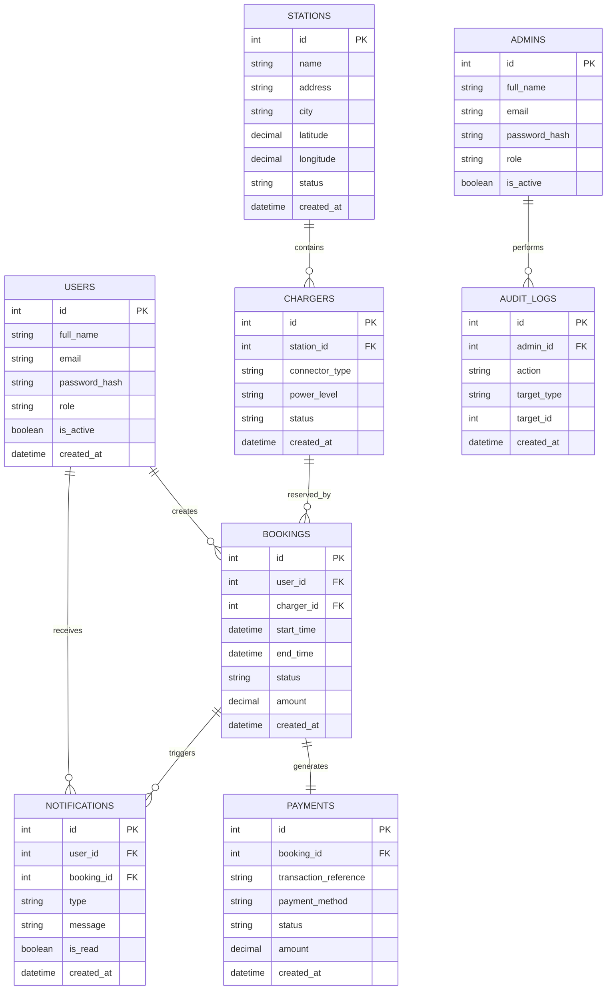

# 8. ER Diagram

## Entity Relationship Summary

The core data model for VoltGo can be represented as follows:

- Users create Bookings
- Stations contain Chargers
- Chargers are reserved through Bookings
- Bookings generate Payments
- Bookings and Payments trigger Notifications
- Admin actions are stored in Audit Logs

## Mermaid ER Diagram

## Why This Diagram Matters

The ER model clarifies entity ownership and data dependencies, which is essential for robust schema design and future development. It helps reduce ambiguity between user-focused workflows and administrative operations.
