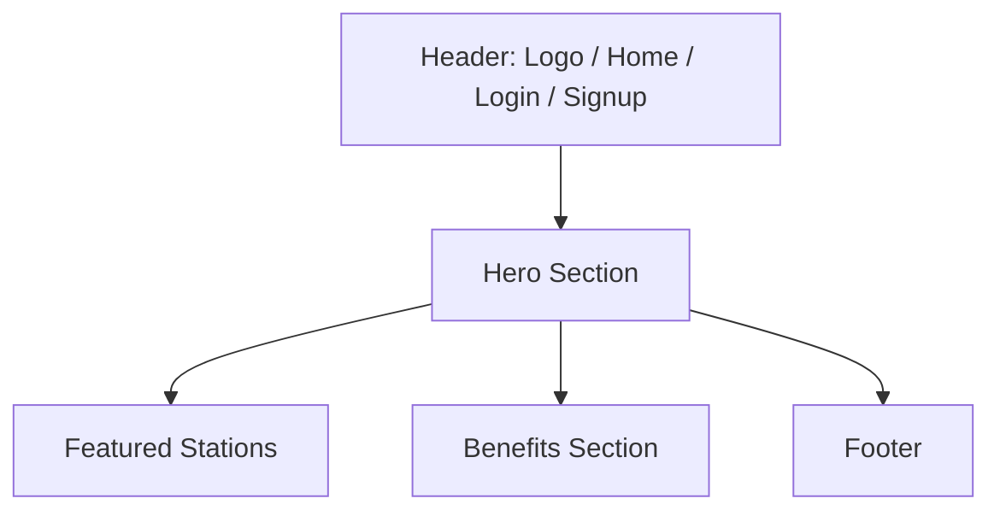

# 6. Wireframes

## Notes

These are low-fidelity wireframes expressed as Mermaid diagrams and ASCII layouts for planning purposes only.

## 1. Landing Page



```text
+--------------------------------------------------------------+
| Logo | Home | Explore | Login | Sign Up                      |
+--------------------------------------------------------------+
| Hero headline, subtext, CTA                                  |
| Featured stations cards                                      |
| Benefits / trust section                                     |
| Footer                                                        |
+--------------------------------------------------------------+
```

## 2. Login

```text
+---------------------------+
| VoltGo                    |
| Email                     |
| Password                  |
| Login                     |
| Forgot Password?          |
| Create account            |
+---------------------------+
```

## 3. Register

```text
+-----------------------------------+
| Create Account                    |
| Full Name                         |
| Email                             |
| Password                          |
| Confirm Password                  |
| Accept Terms                     |
| Create Account                    |
+-----------------------------------+
```

## 4. User Dashboard

```text
+---------------------------------------------+
| Sidebar | Overview | Upcoming Bookings      |
|         | Quick Actions | Saved Stations    |
|         | Account Summary                   |
+---------------------------------------------+
```

## 5. Search Stations

```text
+-----------------------------------------------------------+
| Search Bar | Filters | Map/List Toggle                    |
| Station card 1                                           |
| Station card 2                                           |
| Station card 3                                           |
+-----------------------------------------------------------+
```

## 6. Station Details

```text
+-----------------------------------------------------------+
| Station Hero | Availability | Favourite Button           |
| Charger Types | Amenities | Price                       |
| Select Slot CTA                                         |
+-----------------------------------------------------------+
```

## 7. Booking Flow

```text
+-----------------------------------------------------------+
| Stepper: Select Slot > Review > Payment                  |
| Date picker                                              |
| Time slot grid                                           |
| Continue button                                          |
+-----------------------------------------------------------+
```

## 8. Booking Summary

```text
+-----------------------------------------------------------+
| Booking Summary                                          |
| Station | Date | Time | Charger | Price                  |
| Confirm Booking                                          |
+-----------------------------------------------------------+
```

## 9. UPI Payment Screen

```text
+-----------------------------------------------------------+
| Pay Now                                                  |
| Amount                                                   |
| UPI ID / VPA                                            |
| Pay Button                                               |
| Secure payment message                                   |
+-----------------------------------------------------------+
```

## 10. Payment Success

```text
+-----------------------------------------------------------+
| Success Icon                                             |
| Booking confirmed                                        |
| QR Code Preview                                          |
| View Booking | Go Home                                   |
+-----------------------------------------------------------+
```

## 11. Booking History

```text
+-----------------------------------------------------------+
| Filter Chips | Search                                    |
| Booking card / table rows                                |
| View Details                                             |
+-----------------------------------------------------------+
```

## 12. Favourite Stations

```text
+-----------------------------------------------------------+
| Saved Stations                                           |
| Station card 1                                           |
| Station card 2                                           |
+-----------------------------------------------------------+
```

## 13. User Profile

```text
+-----------------------------------------------------------+
| Profile Header                                           |
| Name / Email / Phone                                     |
| Preferences / Password / Notifications                   |
| Save Changes                                             |
+-----------------------------------------------------------+
```

## 14. Notifications

```text
+-----------------------------------------------------------+
| Notification List                                        |
| Booking reminder                                         |
| Payment confirmation                                     |
| System update                                             |
+-----------------------------------------------------------+
```

## 15. Admin Dashboard

```text
+-----------------------------------------------------------+
| Admin Sidebar | Overview Stats | Recent Activity         |
| Charts / Revenue cards                                   |
+-----------------------------------------------------------+
```

## 16. Manage Stations

```text
+-----------------------------------------------------------+
| Add Station Button                                       |
| Table of Stations                                        |
| Edit / Deactivate / Delete actions                       |
+-----------------------------------------------------------+
```

## 17. Manage Chargers

```text
+-----------------------------------------------------------+
| Charger List by Station                                  |
| Add Charger                                              |
| Status / Connector / Power                               |
+-----------------------------------------------------------+
```

## 18. Manage Users

```text
+-----------------------------------------------------------+
| User Table                                               |
| Filters | Role Chip | Suspend / Details                  |
+-----------------------------------------------------------+
```

## 19. Manage Bookings

```text
+-----------------------------------------------------------+
| Booking Table                                            |
| Status badge / Update action                             |
+-----------------------------------------------------------+
```

## 20. Revenue Analytics

```text
+-----------------------------------------------------------+
| KPI cards | Trend chart | Export button                  |
| Monthly revenue table                                    |
+-----------------------------------------------------------+
```

## 21. Settings

```text
+-----------------------------------------------------------+
| Settings Sections                                        |
| Notification Preferences                                 |
| Security Settings                                        |
| Save Changes                                             |
+-----------------------------------------------------------+
```

## 22. 404 Page

```text
+-----------------------------------------------------------+
| 404                                                        |
| Page not found                                            |
| Back to Home                                              |
+-----------------------------------------------------------+
```
